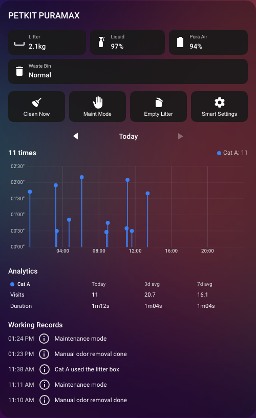
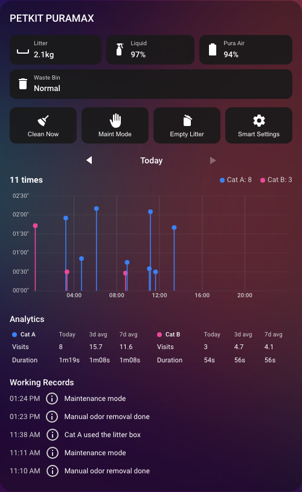

# lovelace-petkit-card

[](https://github.com/AlekseyBlokhin/lovelace-petkit-card/actions/workflows/ci.yml)
[](https://github.com/AlekseyBlokhin/lovelace-petkit-card/actions/workflows/hacs-validate.yml)
[](https://github.com/AlekseyBlokhin/lovelace-petkit-card/blob/main/LICENSE)

## Table of Contents

- [What it does](#what-it-does)
- [Prerequisites](#prerequisites)
- [Installation](#installation)
  - [Via HACS (custom repository)](#via-hacs-custom-repository)
  - [Manual installation](#manual-installation)
- [Adding the card](#adding-the-card)
- [Configuration reference](#configuration-reference)
  - [Top-level keys](#top-level-keys)
  - [`device_entities`](#device_entities)
  - [`cats[]`](#cats)
  - [`info_row[]`](#info_row)
  - [`controls_row[]`](#controls_row)
- [Supported devices](#supported-devices)
- [License](#license)

A Home Assistant Lovelace custom card for PETKIT smart litter boxes: device
status, controls, and per-cat visit analytics — computed entirely
client-side from the device's own `total_use` and `last_used_by` sensor
history. No helper entities and no companion automation are needed at all;
the card reconstructs every visit's duration and cat identity straight from
sensors your PetKit integration already provides.



## What it does

- Device status chips and control buttons, both fully config-driven
  (`info_row` / `controls_row` arrays — add, remove, or reorder them purely
  in YAML, no code changes).
- A day-switchable per-cat visit chart (a 0-24h "stem plot"), reconstructed
  from the device's `total_use`/`last_used_by` sensors — no per-cat helper
  entities needed. A visit the device itself couldn't identify a cat for
  plots as a neutral gray "Unknown" stem rather than being dropped.
- A [Working Records](./docs/ARCHITECTURE.md#how-working-records-works)
  timeline: the device's own `last_event` history, shown verbatim — the
  literal text PETKIT reported, not a computed re-phrasing. No duration
  (that's in the chart/Usage line instead), and no attempt to detect or
  reinterpret a "visit" row via pattern-matching.
- Today / 3-day-avg / 7-day-avg per-cat
  [Analytics](./docs/ARCHITECTURE.md#how-the-chart-usage-line-and-analytics-work),
  with a decline/spike warning banner.
- A per-cat "no visit in N hours" alert banner (configurable, default 8h),
  independent of the decline banner's rolling-average comparison — it won't
  miss a gradual decline the way a percentage-vs-average check can, since
  it's an absolute time check. Optionally pushes a notification too, via any
  `notify.*` entity you configure.
- A real visual config editor (drag the card onto a dashboard and configure
  it with forms — no YAML required to get started), built entirely from
  Home Assistant's own native frontend elements (`ha-form`,
  `ha-expansion-panel`, `ha-icon-button`, a real color-picker for cat
  colors) so it looks and behaves like Home Assistant's own settings pages.

## Prerequisites

- **A PetKit Home Assistant integration**, already installed and configured, exposing your device's entities — either [`RobertD502/home-assistant-petkit`](https://github.com/RobertD502/home-assistant-petkit) or [`Jezza34000/homeassistant_petkit`](https://github.com/Jezza34000/homeassistant_petkit). This card only reads entities; it doesn't talk to PetKit's API itself, and doesn't care which of the two integrations provided them.
- **No helper entities and no companion automation.** The card reads directly from your integration's own "total use" and (if you have more than one cat) "last used by" sensors.
- **No other custom Lovelace cards are required.** This card and its visual editor are self-contained — built only on Home Assistant's own built-in frontend elements (`ha-form`, `ha-icon`, `ha-expansion-panel`, `ha-icon-button`), zero runtime npm dependencies (`package.json` has none). You don't need `card-mod`, `auto-entities`, or anything else installed for it to work.

## Installation

### Via HACS (custom repository)

[](https://my.home-assistant.io/redirect/hacs_repository/?owner=AlekseyBlokhin&repository=lovelace-petkit-card&category=dashboard)

This card isn't in the default HACS store yet, so add it as a custom
repository (or use the one-click badge above):

1. In Home Assistant, go to **HACS → the 3-dot menu (top right) → Custom
   repositories**.
2. Add `https://github.com/AlekseyBlokhin/lovelace-petkit-card` with
   category **Dashboard** (Lovelace plugin).
3. Find **PETKIT PURAMAX Card** in HACS and click **Download**.
4. Home Assistant should auto-register the Lovelace resource. If it
   doesn't, add it manually: **Settings → Dashboards → the 3-dot menu →
   Resources → Add Resource**, URL `/hacsfiles/lovelace-petkit-card/petkit-puramax-card.js`,
   type **JavaScript Module**.
5. Reload the frontend (or hard-refresh the browser).

### Manual installation

1. Download `petkit-puramax-card.js` from the
   [latest release](https://github.com/AlekseyBlokhin/lovelace-petkit-card/releases/latest).
2. Copy it to `<config>/www/petkit-puramax-card.js`.
3. Add it as a Lovelace resource: **Settings → Dashboards → the 3-dot menu
   → Resources → Add Resource**, URL `/local/petkit-puramax-card.js`, type
   **JavaScript Module**.
4. Reload the frontend.

## Adding the card

Either drag **PETKIT PURAMAX Card** from the card picker onto a dashboard
and configure it with the visual editor, or add it via YAML. This is the
smallest valid configuration — every other key (see
[Configuration reference](#configuration-reference) below) takes its
documented default:

```yaml
type: custom:petkit-puramax-card
device_entities:
  total_use: sensor.petkit_puramax_total_use
cats:
  - name: Whiskers
    color: "#4fc3f7"
```

For status chips, control buttons, a second cat, custom event labels, and
alerts, see the [Configuration reference](#configuration-reference) below,
or a full example at
[`examples/dashboard-config.yaml`](./examples/dashboard-config.yaml).

## Configuration reference

### Top-level keys

| Key | Required | Type | Default | Description |
|---|---|---|---|---|
| `type` | yes | string | — | Must be `custom:petkit-puramax-card`. |
| `title` | no | string | `"PETKIT PURAMAX"` | Card header title. |
| `device_entities` | yes | object | — | See [`device_entities`](#device_entities) below. |
| `event_labels` | no | object (`{state: label}`) | `{}` | Merged over the built-in PURAMAX event-label map (config wins). Purely cosmetic renaming of a known raw `last_event` value to nicer text (e.g. `auto_cleaning_completed` → "Auto cleaning done") — never decides whether a row is shown, only how it's captioned. Any raw value with no entry here (including every visit narration) is shown completely verbatim. YAML-only — no visual editor field. |
| `event_exclude` | no | array of strings | `["unavailable", "unknown", "no_events_yet"]` | Raw `last_event` state values hidden from [Working Records](./docs/ARCHITECTURE.md#how-working-records-works) entirely, matched case-insensitively against the exact raw state (never a substring/pattern — a real "Unknown used the litter box" visit is never affected, since its raw text isn't the bare word "unknown"). Replaces the default list rather than merging with it. YAML-only — no visual editor field. |
| `unknown_cat_color` | no | string (CSS color) | `#9e9e9e` | Chart/Usage-line color for a visit the device itself couldn't identify a cat for ([`device_entities.last_used_by`](#device_entities) reporting PURAMAX's `unknown_pet` placeholder). Unrelated to [Working Records](./docs/ARCHITECTURE.md#how-working-records-works), which never inspects visit identity. |
| `cats` | yes | array, min 1 | — | One entry per cat. See [`cats[]`](#cats) below. |
| `info_row` | no | array | `[]` | Status chips, in order. See [`info_row[]`](#info_row) below. |
| `controls_row` | no | array | `[]` | Buttons, in order. See [`controls_row[]`](#controls_row) below. |
| `decline_threshold_pct` | no | number, 0-100 | `60` | [Analytics](./docs/ARCHITECTURE.md#how-the-chart-usage-line-and-analytics-work) warns when today's total is below this percent of the 7-day average (or symmetrically above `200 - this`). |
| `no_visit_alert_hours` | no | number, 1-168 | `8` | Shows a per-cat "hasn't used the litter box" banner once a cat's most recent visit is at least this many hours ago. An absolute check, not relative to history — won't drift the way a rolling-average comparison can. |
| `notify_service` | no | entity id (`notify` domain) | — | If set, also calls this notify entity/service (once per overdue episode, not on every re-render) when a cat crosses `no_visit_alert_hours`. This only fires while the card is actually loaded in a browser/companion-app tab — for a guarantee independent of whether a dashboard is open, pair it with (or use instead) a native HA automation. |

### `device_entities`

| Key | Required | Type | Default | Description |
|---|---|---|---|---|
| `total_use` | yes | entity id | — | The sensor that bumps by one visit's duration on every use (shared across all cats, e.g. PetKit's "Total use"). Its history is the data source for every visit's duration, for all cats combined. |
| `last_used_by` | required if >1 cat | entity id | — | The sensor reporting which cat used the box most recently (e.g. PetKit's "Last used by"). Only needed to disambiguate cats when there's more than one — with a single cat every visit is trivially theirs. |
| `error` | no | entity id | — | Sensor reporting the device's current error/status code. |
| `last_event` | no | entity id | — | Sensor reporting the device's most recent maintenance/cleaning event. |
| `state` | no | entity id | — | Sensor reporting the device's current operating state (used by the `toggle_maintenance` control action). |

### `cats[]`

One entry per cat.

| Key | Required | Type | Default | Description |
|---|---|---|---|---|
| `name` | yes | string | — | Display name. Must exactly match this cat's value as reported by [`device_entities.last_used_by`](#device_entities) — that's how a reconstructed visit gets attributed back to this cat. Not required to match when there's only one cat. |
| `color` | yes | string (CSS color) | — | Chart/legend color for this cat. Picked via HA's native color selector in the visual editor. |

Configuring more than one cat gives each their own chart stem color and
their own Analytics row:



Example with two cats configured — each gets its own chart color and
Analytics row.

### `info_row[]`

Status chips, in order.

| Key | Required | Type | Default | Description |
|---|---|---|---|---|
| `entity` | yes | entity id | — | Entity whose state is displayed. |
| `name` | no | string | entity id | Chip label. |
| `icon` | no | string (mdi icon) | `mdi:information-outline` | Chip icon. |
| `unit` | no | string | — | Appended to the raw state, e.g. `%`. |
| `value_map` | no | object (`{state: label}`) | — | Maps a raw state to a display string (takes precedence over `unit`). YAML-only — no visual editor field. |
| `warn_below` | no | number | — | Chip renders in a "warn" style if the numeric state is below this. |
| `warn_above` | no | number | — | Chip renders in a "warn" style if the numeric state is above this. |
| `warn_state` | no | string | — | Chip renders in a "warn" style if the raw state exactly equals this. |

### `controls_row[]`

Buttons, in order.

| Key | Required | Type | Default | Description |
|---|---|---|---|---|
| `name` | no | string | — | Button label. |
| `icon` | no | string (mdi icon) | `mdi:help` | Button icon. |
| `action` | yes | `press` \| `toggle_maintenance` \| `toggle` \| `more_info` | — | What the button does. |
| `entity` | action-dependent | entity id | — | Required for `press`, `toggle`, `more_info`. |
| `confirm` | no | string | — | If set, `press` shows a confirmation dialog with this text first. |
| `start_entity` | action-dependent | entity id (`button`) | — | Required for `toggle_maintenance`: pressed when not currently in maintenance mode. |
| `exit_entity` | action-dependent | entity id (`button`) | — | Required for `toggle_maintenance`: pressed when currently in maintenance mode. |
| `state_entity` | no | entity id | [`device_entities.state`](#device_entities) | Overrides which entity `toggle_maintenance` reads to decide its current mode. |

`cats`, `info_row`, and `controls_row` all have a repeating-row visual
editor (add/remove buttons); `value_map`, `event_labels`, and
`event_exclude` are YAML-only since an arbitrary object/array has no clean
`ha-form` widget.

For the algorithm details behind the per-cat chart and Analytics — how
visit duration/identity is reconstructed from raw sensor history — see
[How the chart, Usage line, and Analytics work](./docs/ARCHITECTURE.md#how-the-chart-usage-line-and-analytics-work).
For why Working Records is deliberately never cross-referenced with that
reconstruction, see
[How Working Records works](./docs/ARCHITECTURE.md#how-working-records-works).

## Supported devices

Today this card only supports the **PETKIT PURAMAX** — that's the only
device I own, and the config schema (`device_entities`, event vocabulary)
is written against its sensors.

Other PETKIT devices are very welcome, but need community-contributed data
to support: please open a
[New device support request](https://github.com/AlekseyBlokhin/lovelace-petkit-card/issues/new?template=new-device-support.yml)
with your device's entities and example states/attributes. See
[CONTRIBUTING.md](./CONTRIBUTING.md) for details on what's needed and how a
new device card would be added to this repo.

## License

MIT — see [LICENSE](./LICENSE).
